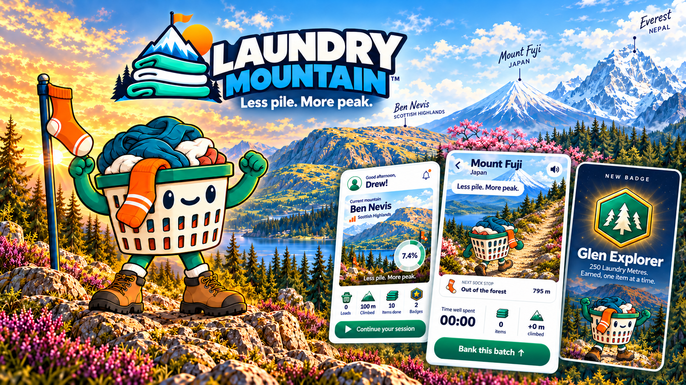
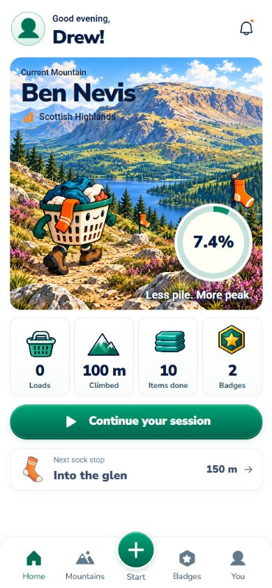
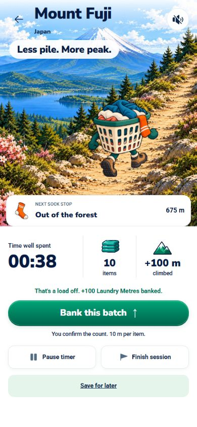
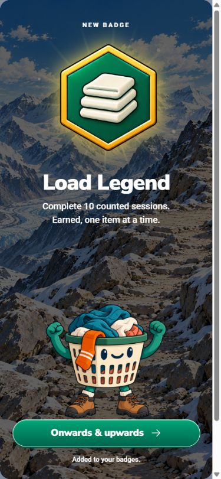

# Laundry Mountain

**Less pile. More peak.** Turn the laundry you finish into a mountain adventure with Basky, your basket companion.



Built for Buildathon Hackyard #4. The current app is a personal, playable adventure across **Ben Nevis, Mount Fuji and Everest**. Start a session, finish some laundry, bank your batch and watch Basky climb.

## How it works

1. **Start your laundry session.** No account or camera is required.
2. **Fold, hang or iron.** Confirm only the items you have just finished using **Bank this batch**.
3. **Climb and collect.** Each item earns exactly **10 Laundry Metres**, with animated movement, sock checkpoints and achievement badges.
4. **Come back tomorrow.** Sessions and progress are saved in the same browser. Reach each summit to unlock the next mountain.

Time and speed do not earn progress. Batch IDs prevent duplicate credit. Existing Ben Nevis saves remain readable, and new progress is tracked separately for each mountain.

## Inside the app

<table>
  <tr><th>Ben Nevis · home</th><th>Mount Fuji · session</th><th>Everest · reward</th></tr>
  <tr>
    <td></td>
    <td></td>
    <td></td>
  </tr>
</table>

Screenshots show isolated review profiles and illustrative progress. They are actual app captures; the cover above is promotional artwork.

## Run locally

Use **Node.js 22.12+ or 24** and npm:

```sh
npm ci
npm run dev
```

Open `http://localhost:5173/` for the landing page, or `http://localhost:5173/?view=home` for the app. No API keys, backend account or environment file is needed for the manual game.

```sh
npm run check             # Vitest, TypeScript and production build
npx playwright install chromium
npm run test:e2e          # Browser regressions (recording recipes excluded)
npm run preview          # Serve the built dist/ directory locally
```

The Windows launcher in `scripts/tool.mjs` handles workspace paths containing `#` with a temporary junction to the same checkout. It does not copy the repository.

## What is implemented

- Three playable mountains with their own scenery, checkpoints, summit rewards and sequential unlocks.
- Manual batches, a pause/resume timer, saved sessions, results and a trail journal.
- A local profile, achievement collection, optional trail sounds and reduced-motion support.
- Phone portrait, landscape and desktop layouts, plus the illustrated landing page.
- Optional batch-photo previews that stay local and are discarded when closed.

**Photo counting in the demo is a labelled concept.** Automatic before/after estimation, cloud sync and accounts are not implemented. The current game uses your confirmed counts. Clearing browser data removes locally saved progress.

An earlier camera/calibration research prototype is retained at `/?view=camera` and `/?view=test`, with geographic exploration at `/?view=expedition`. It is separate from the manual game. Synthetic camera tests do not establish real-world detection accuracy; physical detection remains unvalidated. Camera access on a phone requires HTTPS or a supported secure local context.

## Verification

Submission check, 9 October 2026: **48 unit tests**, **22 browser regressions** across focused runs, TypeScript and the production build passed. The app production-dependency audit reported **zero vulnerabilities**. Browser tests cover manual credit, rewards, persistence, responsive controls and the isolated camera prototype; they do not validate physical laundry detection.

## Demo and creative source

The approved visual demo is **43.8 seconds, 1920 × 1080, 30 fps**, built with Remotion and actual app recordings. It includes a visibly labelled photo-counting concept. The final voiceover/music version is submitted separately on YouTube.

- [Remotion project and rendering instructions](trailer/README.md)
- [ElevenLabs narration script](trailer/VOICEOVER-ELEVENLABS.txt)
- [Scene timings and voiceover cues](trailer/VOICEOVER-43S-CUES.md)
- [Submission cover](trailer/cover/laundry-mountain-combined-final.png)

Rendered exports, personal source recordings, dependency folders and local-only fonts are kept out of Git. The approved composition, trimmed isolated gameplay takes and reusable artwork are included.

## Project layout

| Path | Purpose |
| --- | --- |
| `src/components/` | App screens, mountain scenes, manual session and rewards |
| `src/domain/` | Validated events, deduplicated ledger, progression and achievements |
| `src/vision/` | Preserved camera research prototype |
| `public/art/`, `public/brand/` | App illustrations, mascot and branding |
| `tests/` | Browser regression tests and optional demo recording recipes |
| `trailer/` | Remotion demo source, artwork and narration |
| `docs/` | Project decisions, design evidence and historical handoffs |

React + TypeScript + Vite; localStorage persistence; Vitest + Playwright. The geographic Canvas renderer is preserved alongside the approved illustrated game scenes. The scenes are game illustrations, not navigation maps.

## Credits and project notes

Artwork and mascot assets were developed for Laundry Mountain using AI-assisted illustration and iterative in-app review. Fonts retain their supplied licences; geographic data provenance is in [geography documentation](docs/design/geography.md) and [terrain credits](public/terrain-credits.html).

[Current project state](docs/project-state.md) · [Design QA](design-qa.md) · [Submission notes](docs/submission-plan.md). These documents retain dated history; later entries supersede earlier milestones.
