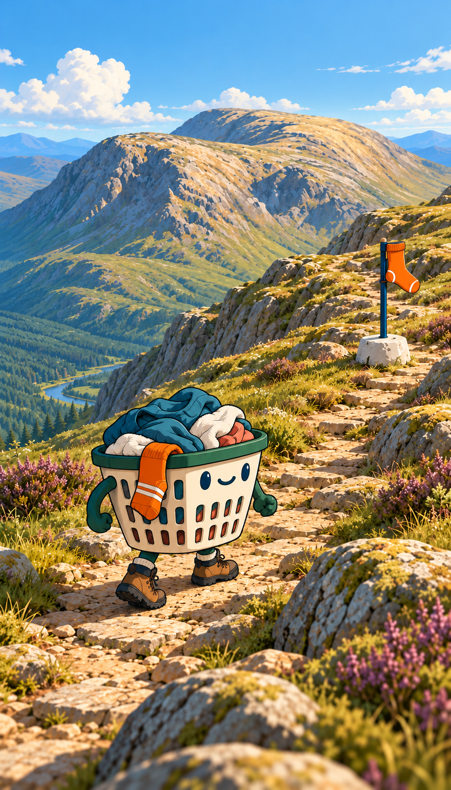

# Approved climb-view direction — 7 October 2026

## Current app direction — 8 October 2026

The owner approved `source-art/approved-app-visual-direction.png` and authorized
implementation on the new `visual-refinement` branch. `main` at `bd064c0` remains
the baseline fallback. The original ten-screen board still anchors the UI family.

Use white surfaces, navy typography, flat emerald controls, richer purpose-composed
welcome/home scenery and the selected basket. No beige/green page wallpaper.
The full overview remains a code-rendered geographic world with route and player
bound to real coordinates. Wide orientation gets its own camera/composition.
Do not reproduce the generated concept's invented lake or trail crossing water.
The home/welcome art is an illustration, not survey evidence. Preserve the approved
active climb, badges and actual local progress. Landing remains parked.

Icon feedback: the first thick-outlined atlas was too cartoonish. The second went
too photographic on the mountain icon. The third uses a simplified sculpted mountain
with the same restrained material shading as the basket/medal; integrated review
is pending. Do not infer visual sign-off from software test results.

Current comparison: `review/visual-refinement/index.html`.
The older home amendment below is historical, superseded by this coordinated board.

**Later home-screen amendment:** the owner explicitly wants the earlier dimensional
basket and more realistic mountain scenery on home. This exception does not change
the approved outlined character or movement in active climb. The original board
at `source-art/original-ui-board.png` continues to govern the surrounding UI.
The current split landing hero was explicitly rejected; its composition needs rework.
The owner then parked landing work: finish the actual app's direction first, as it
will determine the landing design. Full-mountain overview remains under review.

The owner selected the attached outlined mascot study with: "lets go with this one".
This is the latest visual target. The earlier basket identity and movement approvals
still apply; the new image refines the rendering treatment, not the character design.

## Visual reference

Exact selected source: user attachment
`codex-clipboard-ad64bc86-807b-483a-9e60-fd2a6500670f.png`, copied unchanged.
It identifies the third displayed study (internal name: Illustrated contour;
generated source `exec-e27e943b-f666-4e0b-8df4-32fa29babcdc.png`). Selection is
grounded in the attached image, not an inferred number.

The old `approved-basket-climb-concept.png` remains as historical identity context.
The new reference controls the mascot finish: clear navy/deep-teal contour lines,
matte cream/green colour planes, economical shadows and retained rounded volume.
Avoid the earlier embossed, glossy moulded-plastic finish. Keep the same face,
proportions, washing colours, striped orange sock and brown hiking boots. The
detailed painted scenery remains the environment target. This is art direction,
not a game capture or a surveyed route illustration.

## Direction to preserve

- A walking laundry basket is the player avatar: cream basket, forest-green rim,
  short legs and little hiking boots, clothes piled inside, distinctive orange sock.
- Match the latest selected graphic contour treatment without flattening the
  character's volume or changing its identity. Carry the same palette, contour
  restraint and lighting principles into related game artwork and badges.
- Simple expressive face; character personality comes primarily from a determined
  waddle, bobbing washing and a small celebratory hop at checkpoints.
- Climb view follows the character along the trail. Confirmed folding events earn
  movement; full mountain view represents the same saved progress.
- Mature, smooth illustrated mountain scenery supports the playful mascot.
  Avoid pixelated, noisy surfaces and generic mountain silhouettes.
- Explicit audience clarification: this game is for adults. Keep the mascot's
  approved charm, but use a restrained outdoor-adventure treatment for the wider
  UI, typography, copy and rewards. Do not make the whole app childish.
- Ben Nevis first, then Fuji, Matterhorn, Kilimanjaro, Denali and Everest. Retain
  actual geographic identity, proportions and appropriate surroundings.
- Sock checkpoint markers. Cream/navy/emerald UI and flat controls remain the
  wider app direction. The original ten-screen board still anchors other screens.
- Snailwalk supplied the idea of real activity advancing a visible character.
  Its pixel-art treatment, snail and punishment/chase loop are not requirements.

Basket colours, socks and boot unlocks were discussed as possibilities, not a
final reward specification. The mascot has no approved name yet.

## Movement direction approved — 7 October 2026

The owner reviewed the standalone eight-second Remotion animation and said:
"that is cool i like it. the washing in the basket is a bit off but this works for me".

Reference: [Approved movement study](source-art/approved-basket-motion.mp4).
Keep the playful walk, separate boot steps, body sway and checkpoint hop.
The washing remains a refinement item: make it sit naturally inside the rim and
move as a coherent pile, with the draped sock attached convincingly. This is our
interpretation of the washing issue; the owner did not specify its exact cause.

The clip was authored locally in a separate Remotion project; Creative Claw was
not used. Its source is in the task visualization folder, `basket-motion/`.
The export is 720 × 1280, 30 fps, 240 frames. TypeScript passed and idle, walking
and checkpoint poses were inspected. It is a motion reference, not implemented
gameplay, mobile performance evidence, or a validated physical folding session.

## Current boundary

The owner explicitly resumed implementation on 7 October 2026 with "ok lets get
it done", including the whole app, landing page and testing. Use this selected
direction in the existing application. Deployment remains paused.

The movement study establishes the accepted animation direction. Application
integration and real-device checks remain future work. Keep existing code and
unfinished work; do not substitute the concept background or clip for interactive
gameplay.
